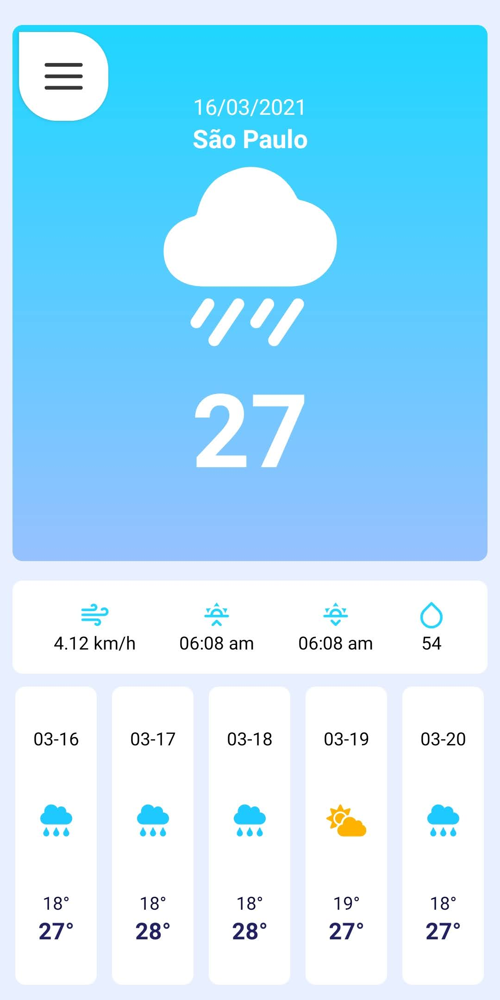

# Tempo

## Description

Tempo is a React Native app that provides an easy way to check the weather conditions of cities.
This app uses an expo structure and external API to make development faster, make sure you have a [WheaterHG key](https://console.hgbrasil.com/keys/new_key_plan) and [expo-cli](https://docs.expo.io/workflow/expo-cli/) has been installed.

<p align="center">
  
</p>

## Development setup

```
git clone https://github.com/bleszerd/Tempo
yarn #or npm install
```
Next, open `app.json` on root of project and edit the last lines of json:

```
...
"extra": {
   "APP_API_KEY": "YOUR API HERE"
}
```
Change `YOUR API HERE` with your [WheaterHG key](https://console.hgbrasil.com/keys/new_key_plan).

Now you can run `expo start` to start Metro Bundler and edit or build the aplication.

**done!**
